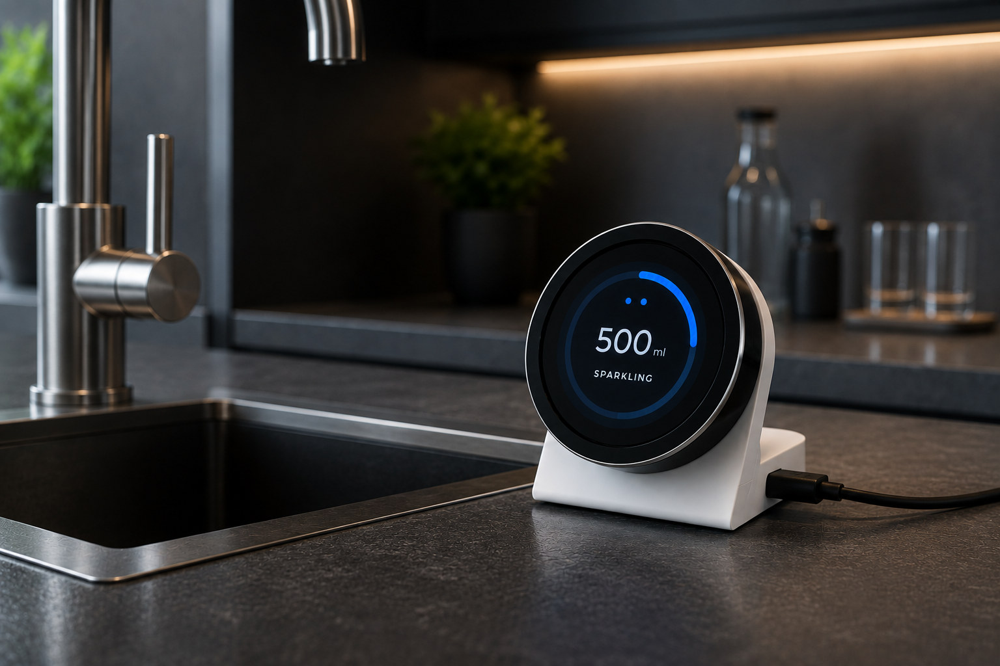
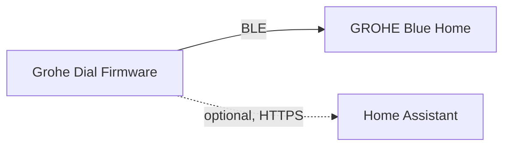
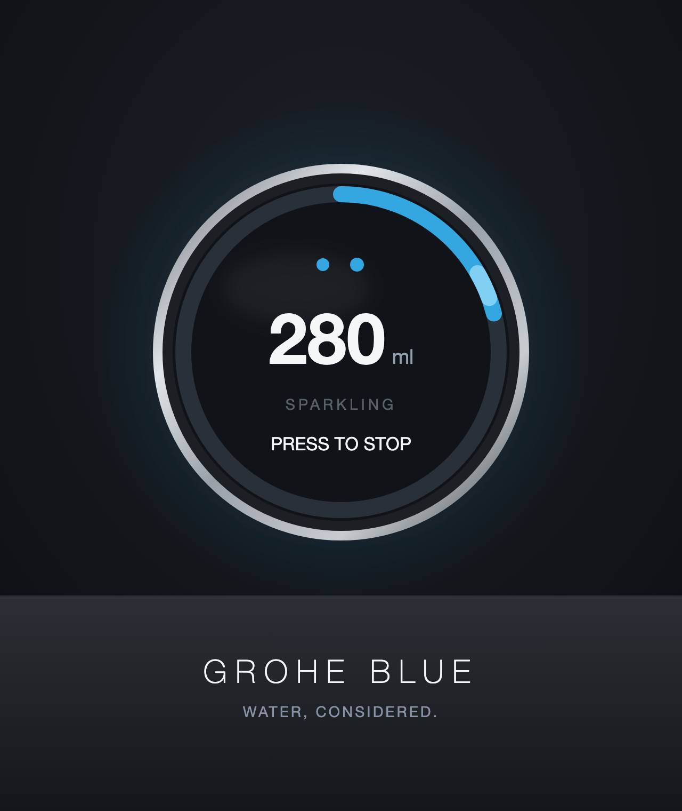

# Grohe Dial

[](LICENSE)
[](https://github.com/espressif/esp-idf)
[](https://www.espressif.com/en/products/socs/esp32-c3)
[](docs/ROADMAP.md)



A small, round, physical dial that controls a [GROHE Blue](https://www.grohe.com/) Home
water appliance over Bluetooth Low Energy — rotate to choose an amount, press
to pour.

## Project

Grohe Dial is native [ESP-IDF](https://github.com/espressif/esp-idf) (C++20)
production firmware for a round ESP32-C3 display/encoder module. It talks
directly to a GROHE Blue Home appliance over BLE — there is no cloud
dependency and no GROHE app in the loop.

**This repository is the production firmware and the primary project.**
GROHE publishes no protocol specification for this appliance, so the BLE
protocol it speaks was independently reverse-engineered in a companion
project, [`grohe_blue_ble`](https://github.com/JonSche/grohe_blue_ble), and
re-implemented here from scratch as production firmware. That companion
repository remains useful on its own as a protocol reference and a Python
research toolkit for anyone exploring the appliance further, but this
firmware does not depend on it at build or run time — see [Reverse
engineering](#reverse-engineering) below for the full picture.

- **ESP32-C3-based smart dial**: a 240×240 round display, a rotary encoder,
  and a push button are the entire user interface.
- **Controls a GROHE Blue appliance over BLE**: authenticated dispense/stop
  commands, sent directly to the appliance.
- **Independently reverse-engineered protocol**: own HMAC/payload code, own
  BLE state machine — implemented from scratch in this codebase.
- **Home Assistant integration is optional, not required**: the dial is fully
  usable — dispense, stop, reconnect, everything — with no Home Assistant,
  no Wi-Fi even, present at all. A future, optional integration (see
  [Roadmap](#roadmap)) extends the product; it never becomes a dependency of
  it.

## Features

Implemented:

- [x] BLE communication with the appliance (NimBLE), including automatic
      reconnect with backoff after a dropped or failed connection
- [x] Authenticated dispense (HMAC-signed commands, ported from the
      reverse-engineered protocol)
- [x] Stop dispense mid-pour
- [x] Three water types: Still / Medium / Sparkling
- [x] Rotary-encoder-driven round UI (amount, water type, live progress ring,
      connection/time status)
- [x] Display sleep (backlight-only inactivity timeout)
- [x] SNTP time synchronization (a one-shot Wi-Fi connection at boot; not a
      runtime dependency for anything else)
- [x] Firmware version/build metadata embedded in every build, logged at boot

Planned:

- [ ] Optional Home Assistant integration — configuration, diagnostics, and
      appliance status (CO₂, filter, firmware version); never required for
      basic dispensing

See [`docs/ROADMAP.md`](docs/ROADMAP.md) for the full, itemized milestone
list.

## Hardware

- **MCU**: ESP32-C3 (single-core RISC-V, Wi-Fi + BLE).
- **Display**: 1.28", 240×240 round GC9A01 SPI display.
- **Input**: a quadrature rotary encoder with an integrated push button.
- **Current development hardware**: [VIEWE
  UEDX24240013-MD50E-B](https://viewedisplay.com/product/esp32-1-28-inch-240x240-round-tft-knob-display-gc9a01-arduino-lvgl/),
  an off-the-shelf ESP32-C3 + display + encoder module — see
  [`components/board/include/board/board_config.hpp`](components/board/include/board/board_config.hpp)
  for the exact pinout.
- **Custom PCB**: planned for a future milestone; the current hardware is
  intentionally an off-the-shelf module so the firmware architecture can
  mature before committing to board design.

| Function | GPIO |
|---|---|
| LCD SCLK | 1 |
| LCD MOSI/SDA | 0 |
| LCD CS | 10 |
| LCD DC | 4 |
| LCD Backlight | 8 |
| LCD Reset | none (module has no reset line) |
| Encoder Phase A | 7 |
| Encoder Phase B | 6 |
| Button | 9 |

## Architecture



The firmware talks to the appliance directly over BLE — that link is the
whole product. Home Assistant is an optional, separate integration hanging
off the side, never a dependency of the BLE path.

Internally, the firmware is a small set of single-purpose components (BLE,
display, encoder, UI, time sync, ...) wired together by one composition
root, with dependencies pointing strictly one way. See
[`docs/ARCHITECTURE.md`](docs/ARCHITECTURE.md) for the full component map,
the BLE protocol/state-machine writeup, and the reasoning behind every
non-obvious decision.

## Project status

The core product is implemented and hardware-validated: BLE pairing/
reconnect, authenticated dispense/stop (Still and Sparkling), the dial UI,
SNTP time sync, and display sleep have all been verified on real hardware.
Medium water type is implemented but not yet confirmed on the physical
appliance. Firmware version/build metadata is implemented and
build-verified.

See [`docs/ROADMAP.md`](docs/ROADMAP.md) for the complete, itemized
milestone history and what's next, and the "v1.0 Release Criteria" section
at the bottom of it for what "done" means for this project.

## Building

Requirements:

- [ESP-IDF](https://docs.espressif.com/projects/esp-idf/en/stable/esp32c3/get-started/index.html)
  v5.3 or newer, with the IDF Component Manager (bundled by default).
- Target: `esp32c3`.

```sh
. $IDF_PATH/export.sh
idf.py set-target esp32c3
idf.py build flash monitor
```

Real appliance/Wi-Fi credentials are never committed — copy the two
`*_local.hpp.example` files under `components/grohe_ble/` and
`components/time_service/` to their non-`.example` names and fill in your
own values before building against a real appliance.

## Reverse engineering

The BLE protocol this firmware speaks — service/characteristic layout,
authenticated command format, response codes — was independently
reverse-engineered from the official mobile app's own behavior and traffic,
first in the companion
[`grohe_blue_ble`](https://github.com/JonSche/grohe_blue_ble) project (see
[Project](#project) above for how the two repositories relate), then
documented and re-implemented from scratch as production firmware here.

This repository does **not** contain decompiled app code. What it does
contain is [`docs/ARCHITECTURE.md`](docs/ARCHITECTURE.md): this firmware's
own protocol write-up, including a per-field evidence/confidence table for
every piece of appliance state it relies on. The original packet captures
and reverse-engineering evidence notes live in `grohe_blue_ble`'s own
documentation.

## Disclaimer

This project is an independent open source project and is not affiliated
with, endorsed by, or sponsored by GROHE AG.

## Screenshots

**UI concept** *(design mockup, not a live screen capture)*



## Roadmap

[`docs/ROADMAP.md`](docs/ROADMAP.md) is organized as one section per
milestone (M0 through M13), each with its own scope and, once complete, a
hardware-validation summary — the authoritative history of how this
firmware got to where it is today.

## Contributing

Issues and pull requests are welcome — see
[`CONTRIBUTING.md`](CONTRIBUTING.md) for build instructions, coding style,
and how to propose a change. Found a security issue instead? See
[`SECURITY.md`](SECURITY.md).

## License

[MIT](LICENSE)
