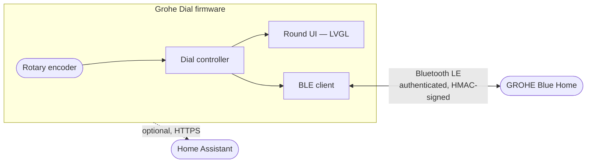

<div align="center">


# Grohe Dial

**A local-first smart dial for GROHE Blue Home.**

✔ Bluetooth Low Energy&nbsp;&nbsp;·&nbsp;&nbsp;✔ No Cloud&nbsp;&nbsp;·&nbsp;&nbsp;✔ Open Source&nbsp;&nbsp;·&nbsp;&nbsp;✔ Off-the-Shelf Hardware

[](LICENSE)
[](https://github.com/espressif/esp-idf)
[](https://www.espressif.com/en/products/socs/esp32-c3)
[](docs/ROADMAP.md)

[Why it's different](#why-its-different) &nbsp;·&nbsp;
[Hardware](#hardware) &nbsp;·&nbsp;
[Quick start](#quick-start) &nbsp;·&nbsp;
[Architecture](#architecture) &nbsp;·&nbsp;
[Roadmap](#roadmap)

</div>

<br>

Grohe Dial replaces the phone app for the one thing you actually do ten times
a day: pour water. Turn the knob to choose an amount, press to pour, watch a
ring fill in real time. No phone, no app, no cloud round-trip — just a knob
on your counter that does one thing perfectly.

GROHE publishes no protocol specification for the Blue Home appliance it
talks to. The BLE protocol this firmware speaks was independently
reverse-engineered from scratch — see [Reverse engineering](#reverse-engineering)
below — and re-implemented here as real, hardware-validated ESP-IDF C++
firmware, not a hobby sketch.

<br>

## Why it's different

<table>
<tr>
<td width="50%" valign="top">

### 🔒 Local-first

Talks to the appliance directly over Bluetooth Low Energy. No cloud, no
vendor account, no internet connection required — ever. Unplug your router
and it still pours.

</td>
<td width="50%" valign="top">

### 🎛️ Built for the knob

A round UI designed from zero around a rotary encoder — not a touchscreen
app squeezed into a circle. Smooth animations, a live progress ring, one
button.

</td>
</tr>
<tr>
<td width="50%" valign="top">

### 💵 Real hardware, real price

One off-the-shelf ESP32-C3 module, about $25, complete out of the box. No
custom PCB to design, no BOM to source, no reflow oven.

</td>
<td width="50%" valign="top">

### 🔓 Actually open

MIT-licensed firmware, a from-scratch protocol write-up with a confidence
rating on every field, and every non-obvious design decision explained in
[`ARCHITECTURE.md`](docs/ARCHITECTURE.md).

</td>
</tr>
</table>

<br>

## See it in action

<p align="center">


</p>

<p align="center"><sub>UI concept mockups — the frozen spec this firmware implements pixel-for-pixel. More in <a href="#screenshots">Screenshots</a>.</sub></p>

<br>

## Hardware

Everything runs on one off-the-shelf board. No board design, no soldering, no BOM.

| | |
|---|---|
| **Module** | [VIEWE UEDX24240013-MD50E-B](https://viewedisplay.com/product/esp32-1-28-inch-240x240-round-tft-knob-display-gc9a01-arduino-lvgl/) |
| **Price** | ≈ $25 (at time of writing — check the listing for current pricing) |
| **MCU** | ESP32-C3 · 160 MHz · Wi-Fi + BLE 5 |
| **Display** | 1.28″ round IPS, 240×240, GC9A01 driver |
| **Input** | Integrated rotary encoder with push button |
| **Assembly** | Plug in USB-C. That's the whole bill of materials. |

> [!TIP]
> This is genuinely the entire parts list. If you can plug in a USB-C cable, you already have everything you need to build one.

<details>
<summary><strong>Full GPIO pinout</strong> (for the board revision this firmware targets)</summary>
<br>

| Function | GPIO |
|---|---|
| LCD SCLK | 1 |
| LCD MOSI/SDA | 0 |
| LCD CS | 10 |
| LCD DC | 4 |
| LCD Backlight | 8 |
| LCD Reset | none (module has no reset line) |
| Encoder Phase A | 7 |
| Encoder Phase B | 6 |
| Button | 9 |

See [`components/board/include/board/board_config.hpp`](components/board/include/board/board_config.hpp)
for the source of truth.

</details>

### The enclosure

The module above is a bare circular board. Grohe Dial hides it inside a
small 3D-printed stand — from the outside, it looks like a finished product
sitting next to the tap, not a dev board on a breadboard.

**No soldering. No custom PCB. Print it, drop the module in, plug in a
cable.**

Print files, print settings, and assembly steps live in
[`hardware/enclosure/`](hardware/enclosure/).

<br>

## Architecture



One composition root wires together small, single-purpose components — BLE,
display, encoder, UI, time sync — with dependencies pointing strictly one
way. The full component map, the BLE protocol/state-machine write-up, and
the reasoning behind every non-obvious decision live in
[`docs/ARCHITECTURE.md`](docs/ARCHITECTURE.md).

<br>

## Project status

| Area | Status |
|---|---|
| BLE pairing, reconnect, authenticated dispense/stop | ✅ Hardware-validated |
| Round UI — progress ring, animations, display sleep | ✅ Hardware-validated |
| SNTP time sync | ✅ Hardware-validated |
| Water types — Still / Sparkling / Medium | ✅ Still & Sparkling validated · Medium implemented, unconfirmed on the physical appliance |
| Firmware version/build metadata | ✅ Implemented, build-verified |
| OTA firmware updates | ⛔ Built, hardware-tested, then fully reverted — see [`ROADMAP.md`](docs/ROADMAP.md) |
| Home Assistant integration | 🔜 Planned, always optional |

See [`docs/ROADMAP.md`](docs/ROADMAP.md) for the complete milestone-by-milestone
history, and its "v1.0 Release Criteria" section for what "done" means for
this project. Nothing here is claimed as validated unless it's actually been
run on real hardware.

<br>

## Quick start

> [!NOTE]
> Requires [ESP-IDF](https://docs.espressif.com/projects/esp-idf/en/stable/esp32c3/get-started/index.html) v5.3 or newer (with the IDF Component Manager, bundled by default) and the board above.

```sh
. $IDF_PATH/export.sh
idf.py set-target esp32c3
idf.py build flash monitor
```

> [!IMPORTANT]
> Real appliance/Wi-Fi credentials are never committed. Copy the two
> `*_local.hpp.example` files under
> [`components/grohe_ble/`](components/grohe_ble/) and
> [`components/time_service/`](components/time_service/) to their
> non-`.example` names and fill in your own values before building against a
> real appliance.

Expect a boot log that looks like this:

```
I (536) app: Grohe Dial
I (546) app: Firmware: v1.0.0-dev
I (546) app: Commit: ba1155f (main)
I (536) main_task: Started on CPU0
```

<details>
<summary><strong>Full implemented/planned feature list</strong></summary>
<br>

Implemented:

- [x] BLE communication with the appliance (NimBLE), including automatic
      reconnect with backoff after a dropped or failed connection
- [x] Authenticated dispense (HMAC-signed commands, ported from the
      reverse-engineered protocol)
- [x] Stop dispense mid-pour
- [x] Three water types: Still / Medium / Sparkling
- [x] Rotary-encoder-driven round UI (amount, water type, live progress ring,
      connection/time status)
- [x] Display sleep (backlight-only inactivity timeout)
- [x] SNTP time synchronization (a one-shot Wi-Fi connection at boot; not a
      runtime dependency for anything else)
- [x] Firmware version/build metadata embedded in every build, logged at boot

Planned:

- [ ] Optional Home Assistant integration — configuration, diagnostics, and
      appliance status (CO₂, filter, firmware version); never required for
      basic dispensing

</details>

<br>

## Roadmap

| Phase | Status |
|---|---|
| Hardware bring-up, display, input | ✅ Shipped |
| BLE client foundation, reverse-engineered protocol | ✅ Shipped |
| Dispense, stop, water types | ✅ Shipped |
| Time sync, dispense UI, display sleep | ✅ Shipped |
| Firmware version/build metadata | ✅ Shipped |
| OTA firmware updates | ⛔ Reverted |
| Debugging & flashing tooling | 🚧 In progress |
| Home Assistant integration | 🔜 Planned |

[`docs/ROADMAP.md`](docs/ROADMAP.md) is organized as one section per
milestone (M0 through M13), each with its own scope and, once complete, a
hardware-validation summary — the authoritative history of how this
firmware got to where it is today.

<br>

## Reverse engineering

The BLE protocol this firmware speaks — service/characteristic layout,
authenticated command format, response codes — was independently
reverse-engineered from the official mobile app's own behavior and traffic,
first in the companion
[`grohe_blue_ble`](https://github.com/JonSche/grohe_blue_ble) project, then
documented and re-implemented from scratch as production firmware here.

**This repository is the production firmware and the primary project.**
`grohe_blue_ble` remains useful on its own as a protocol reference and a
Python research toolkit for anyone exploring the appliance further, but this
firmware does not depend on it at build or run time.

This repository does **not** contain decompiled app code. What it does
contain is [`docs/ARCHITECTURE.md`](docs/ARCHITECTURE.md): this firmware's
own protocol write-up, including a per-field evidence/confidence table for
every piece of appliance state it relies on. The original packet captures
and reverse-engineering evidence notes live in `grohe_blue_ble`'s own
documentation.

<br>

## Screenshots

**UI concept**

<p align="center">


</p>

<sub>Design mockups, not live screen captures — the frozen spec this firmware implements. See [`docs/ui/`](docs/ui/) for the complete set, including the full dispense-lifecycle breakdown.</sub>

**Hardware**

<p align="center">

</p>

<sub>More hardware, assembly, and wiring photos are welcome — see <a href="CONTRIBUTING.md">CONTRIBUTING.md</a> if you'd like to add yours.</sub>

<br>

## Disclaimer

This project is an independent open source project and is not affiliated
with, endorsed by, or sponsored by GROHE AG.

<br>

## Contributing

Issues and pull requests are welcome — see
[`CONTRIBUTING.md`](CONTRIBUTING.md) for build instructions, coding style,
and how to propose a change. Found a security issue instead? See
[`SECURITY.md`](SECURITY.md).

## License

[MIT](LICENSE)
