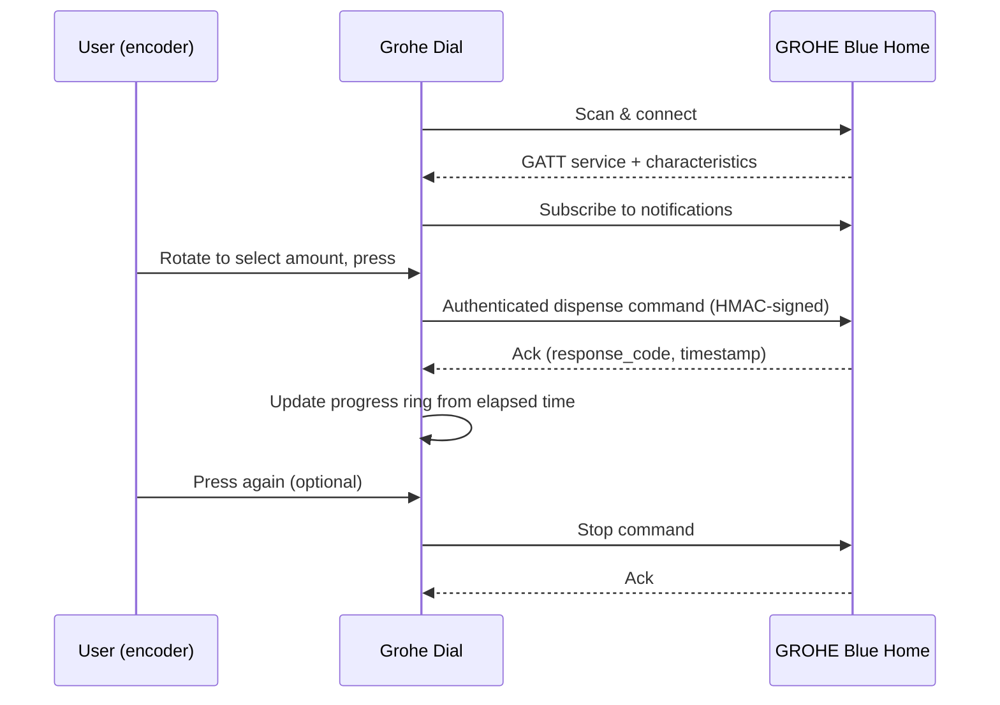
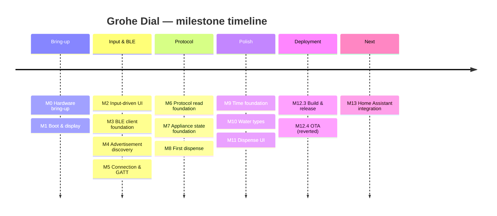

# Visual assets brief

Reference material for the [README](../../README.md) redesign: image prompts,
extra diagrams, icon direction, and screenshot suggestions that didn't belong
inline in the README itself. Nothing in this doc is required reading to use
or build the project — it's a working brief for whoever picks up the next
round of visual assets (including future-you).

What's already real and committed, used directly in the README:

- `docs/images/hero_shot.png` — the kitchen hero photo.
- `docs/ui/mockups/{hero-mockup,dispense-lifecycle-final,ring-follows-encoder}.{png,svg}` — UI concept mockups.
- `docs/design/icons/*.svg` — three hand-drawn line icons (below).

Everything else here is a prompt or a concept, not a shipped asset — this
session's toolset can produce Markdown, SVG, and Mermaid directly, but not
photorealistic renders. Treat the prompts as ready to paste into an image
model (Midjourney, DALL·E, Stable Diffusion, etc.).

## 1. Image prompts

### Hero — alternate/future take

The current hero shot already lands the brief (premium kitchen, dark stone
counter, faucet, shallow depth of field, warm light, no logos). If it's ever
reshot or a variant is wanted for social/OG previews:

> Photorealistic product photography, modern premium kitchen, dark honed
> stone countertop, brushed-steel GROHE-style pull-down faucet, integrated
> undermount sink, a small round white smart dial with a soft blue glowing
> ring display sitting beside the sink, thin USB-C cable running off-frame,
> warm golden-hour under-cabinet lighting, shallow depth of field with the
> dial in sharp focus and the faucet softly blurred behind it, shot on a
> full-frame 85mm lens at f/1.8, no visible logos, no text, no brand marks,
> Apple product-launch photography style, clean and minimal.

### Product — studio shot

> Studio product photography, a small round white 3D-printed pedestal stand
> roughly 6cm tall holding a circular 1.28-inch display module face-up, soft
> diffused three-point lighting, pure light-grey seamless background, subtle
> soft shadow beneath the base, 45-degree elevated angle, macro-level detail
> on the display bezel, no logos, no text, commercial product photography,
> shot for an e-commerce/premium hardware listing.

### Exploded view

> Technical exploded-view product illustration, isometric angle, a small
> round smart-dial device separated into three floating layered
> components — top: circular display module with visible rotary knob; middle:
> empty air gap; bottom: white 3D-printed pedestal base with a USB-C port
> cutout — thin dashed alignment lines connecting each part vertically,
> clean light background, soft ambient occlusion shadows, minimal technical
> illustration style similar to Apple teardown diagrams or iFixit exploded
> views, no text labels, no logos.

### Assembly — step shots (sequence of 3–4)

> Overhead flat-lay photography, hands 3D-printing and assembling a small
> round electronic display module into a white pedestal enclosure, on a
> clean light wood desk, soft natural window light, minimal props (a
> USB-C cable, the bare display module, the printed white stand), shot in
> sequence showing: (1) the empty printed stand alone, (2) the display
> module being lowered into the stand, (3) the USB-C cable being routed
> through the base cutout, (4) the finished assembled dial standing upright
> — consistent lighting and framing across all four, no text overlays, no
> logos, clean minimal product-tutorial photography style.

### Kitchen context — lifestyle variant

> Lifestyle photography, a hand reaching to turn the knob on a small round
> smart dial mounted beside a kitchen sink, motion slightly implied, warm
> natural daylight from a nearby window, dark stone countertop, soft bokeh
> background showing a glass being filled at the faucet, candid unposed
> feel, shallow depth of field, no logos, no text, editorial kitchen-tech
> photography style.

## 2. SVG diagrams

Three hand-authored line icons are committed in `docs/design/icons/`
(48×48 viewBox, neutral grey `#71717a` stroke, transparent background — safe
on light and dark backgrounds alike):

| File | Represents |
|---|---|
| `icon-local-first.svg` | No-cloud / local-first (crossed-out cloud) |
| `icon-knob.svg` | The rotary encoder / dial interaction |
| `icon-open-source.svg` | Open source / community (branching node graph) |

These are intentionally simple enough to hand-author directly as SVG (a few
circles and paths) rather than something that needs an image model. If the
README ever grows a dedicated icon row under the feature cards, these three
are ready to use as-is; a matching fourth (`icon-affordable.svg`, e.g. a
simple price-tag glyph) would complete the set used in
[Why it's different](../../README.md#why-its-different).

Beyond icons, an **exploded-view diagram** (display module / enclosure /
cable, in the same line-art style) would be a genuinely useful *real* SVG to
hand-author once the enclosure geometry is finalized in
[`hardware/enclosure/`](../../hardware/enclosure/) — worth revisiting once
those CAD files land, rather than guessing proportions now.

## 3. Additional Mermaid diagrams

The README carries one Mermaid diagram (component flow, under
[Architecture](../../README.md#architecture)). Two more are drafted here,
ready to drop into `docs/ARCHITECTURE.md` where they'd sit naturally
alongside the existing prose write-up — not added there yet, to avoid
scope-creeping this visual pass into a documentation rewrite.

**BLE pairing → dispense sequence**, for `ARCHITECTURE.md`'s "BLE protocol"
section:

**Roadmap timeline**, an alternative to the status table currently in the
README, for anyone who prefers a literal timeline view (kept here rather
than in the README since the table is more compact and equally "visual" at
README scale):

## 4. Animation concepts

No Lottie/GIF rendering tool is available in this session — these are
concepts for whoever builds the actual asset (After Effects → Lottie, or a
screen-recorded GIF straight from hardware once available).

- **Progress ring fill (hero loop, ~3s, looping).** The core "sell" motion:
  the round display's blue ring sweeps from empty to full over ~2.5s, then
  holds a beat, then resets — matching the actual on-device dispense
  animation. Ideal as a small looping GIF/Lottie embedded near the top of
  the README once captured from real hardware (a screen recording beats any
  synthetic recreation here — the honesty bar this project holds for
  hardware claims applies to motion too).
- **Encoder → UI response (README micro-demo, ~2s).** Split-screen or
  side-by-side: a hand rotating the physical knob on the left, the
  selection ring/value updating in lock-step on the right. Sells "built for
  the knob" better than any still image could.
- **Exploded-view assembly (~4s, for the Hardware/enclosure section).** The
  exploded-view illustration from §1/§2 animates from assembled → exploded
  → reassembled, implying "it's just three parts, snap together."
- **Boot-to-ready sequence (~3s).** Splash screen → BLE connecting spinner
  → ready state, screen-recorded from real hardware once convenient —
  doubles as an honest demonstration of actual boot time.

## 5. Icon recommendations

For anywhere the README or docs want a small inline glyph beyond the three
custom ones above (e.g. a future badges row, a callout icon), pull from one
consistent outline set rather than mixing styles:

- **[Lucide](https://lucide.dev)** — the best fit for this project's
  minimal/technical tone; consistent 24×24 stroke grid, MIT-licensed, easy
  to hand-edit as SVG (same approach used for the three custom icons here).
  Relevant glyphs already in the set: `bluetooth`, `cloud-off`,
  `git-branch`/`github`, `cpu`, `disc` (stand-in for the round display),
  `printer` (3D-print/enclosure), `shield-check` (security/disclaimer).
- Avoid mixing in a second icon family (e.g. Font Awesome alongside Lucide)
  — inconsistent stroke weight/corner radius is one of the fastest ways a
  README starts looking assembled rather than designed.

## 6. Additional screenshot suggestions

The README's [Screenshots](../../README.md#screenshots) section intentionally
stays small and real (only committed assets). Categories worth capturing
once the hardware/enclosure is in a photographable state, roughly in
priority order:

1. **Hardware** — a clean studio shot of the assembled dial alone (see the
   "Product — studio shot" prompt in §1 as a placeholder direction, or a
   real photo once convenient).
2. **Assembly** — the 3–4 step sequence from §1's "Assembly" prompt, shot
   for real once `hardware/enclosure/` has print files; this is one of the
   strongest "no soldering, no PCB" proof points and deserves real photos
   over any illustration.
3. **Firmware** — a terminal screenshot of `idf.py monitor` boot output
   (real, not staged) — reinforces the "real hardware-validated firmware,
   not a hobby sketch" positioning from the README's opening paragraph.
4. **Architecture** — a rendered view of the Mermaid diagrams already in
   the README/`ARCHITECTURE.md`; no separate asset needed, just worth
   knowing GitHub renders these natively so no export step is required.
5. **UI** — already well covered by the three existing mockups; a fourth
   showing the "CONNECTING" / "OFFLINE" / "NO TIME" status states (see
   `docs/ARCHITECTURE.md`'s appliance-state section) would round out the
   set with states that aren't the happy path.
