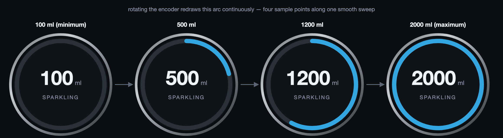
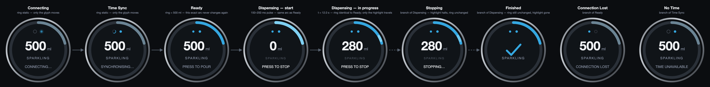

# Grohe Dial — Dispense Animation: Production Specification

**Status: frozen. This is the definitive, implementation-ready UI
specification for LVGL on the Grohe Dial.** It is a complete rewrite, not an
addendum — everything superseded by the reasoning in this document has been
removed, not archived here. The two design-history documents,
[`dispense_animation_concepts.md`](dispense_animation_concepts.md) and the
prior revisions of this file, exist only as a record of how this
specification was arrived at. Nothing in them overrides anything here.

This spec ends with a brutally honest final review (§17). If you're
skimming, that section states plainly whether this is ready to build.

---

## 1. Philosophy

Calm. Minimal. Confident. Elegant. Never playful, never flashy, never a
loading spinner. Every animation exists to communicate one of exactly two
things: **confidence that a value is real**, or **calm acknowledgement that
the system heard you**. Nothing exists purely to look nice. Consistency
outranks cleverness — one visual idiom, reused, beats several clever ones.

---

## 2. Design review: challenging every element

This section is the reasoning, not just the conclusion. Every element below
was asked the same six questions: *Does it have a purpose? Is it the
simplest possible solution? Does it communicate the correct meaning? Would
Dieter Rams remove it? Would Apple keep it? Would GROHE ship it?*

### 2.1 The central question: should the ring show progress?

**The previous design had the ring shrink during dispensing** — starting at
the dialled-amount arc and depleting toward empty as the pour completed.
Revisiting it against the questions above surfaces a real problem, not a
stylistic preference:

- **Redundant information.** Once a pour starts, the numeral counts up and
  the dialled amount stops being displayed anywhere as a number. The
  shrinking ring's value (`remaining = target − delivered`) is fully
  derivable from information the numeral already carries — it's the same
  fact, encoded a second time, in a harder-to-read form (an angular fraction
  against an unmarked 100–2000 ml scale, versus a printed number).
- **A quiet meaning-shift, not a jump.** The arc no longer visibly *jumps*
  between Ready and Dispensing — that was fixed in the prior revision — but
  the question it answers still changes: at Ready it answers "what did I
  select"; mid-pour the identical-looking arc answers "what's left." Those
  are different questions sharing one visual encoding, which is a subtler
  version of the same problem, not a different one.
- **The target itself becomes invisible.** With the numeral committed to
  counting delivered volume, the shrinking ring was the *only* remaining way
  to recall the original amount mid-pour — and it encoded that recall badly
  (an arc-length judgement against an implicit scale) precisely at the
  moment the design needed it to encode it well.
- **The realistic use case undercuts the case for a progress gestalt.**
  Someone dispensing water is standing at the tap, watching the glass
  itself fill — the physical vessel is already the primary, continuous,
  high-resolution progress signal in their actual field of view. The dial's
  job is secondary confirmation, where a precise number outperforms a coarse
  angular estimate.

**Rams removes it** — it's machinery duplicating a job the numeral already
does. **Apple**, for this context, likely doesn't keep it either — a
depleting ring is the Activity-ring idiom, which is deliberately gamified;
this device wants the opposite register. **GROHE** does not ship a device
that visually dramatizes "the amount you asked for is dwindling" when the
actual answer is already printed on the screen.

**Conclusion: redesigned.** The ring becomes **fully invariant.** One arc,
computed once from the dialled amount, unchanged from the moment it's set
until a new amount is dialled — through Ready, the entire Dispensing state,
Stopping, and Finished. It answers exactly one question, always: *what did
I ask for.* Progress is the numeral's job alone, and it needed no help. See
§4–§5 for the full mechanism, and §14 for the storyboard that proves the
ring is pixel-identical across five separate states.

### 2.2 Every other element, held to the same standard

| Element | Purpose | Simplest solution? | Verdict |
|---|---|---|---|
| **Startup pulse** (§8) | Confirms the SUCCESS ack was received — distinct from confirming ongoing flow, since real BLE latency separates "pressed" from "acknowledged." | Considered folding it into the highlight's onset; rejected — an ack and an ongoing-flow signal are two different facts, and the gap between them is real, not decorative. | **Keep**, unchanged. |
| **Finished checkmark** (§9) | The ring no longer changes at Finished, by design — something has to signal completion, and this is the minimum possible unit that can. | A single glyph, once. Nothing simpler communicates "done." | **Keep** — now the *only* completion signal rather than one of two (the ring's old settle-to-floor animation is gone entirely, §2.3), so it's less redundant than before, not more. |
| **Water-type de-emphasis** (§7) | Attention hierarchy while a number is actively changing: delivered amount, then stop instruction, then water type. | Genuinely the weakest-justified element here — it's a real hierarchy signal, not decoration, and it costs nothing (a one-time style swap, not a continuous animation), but it's the one change I'd revisit first if this needed to get simpler still. | **Keep**, flagged honestly rather than silently defended. |
| **Connectivity glyphs** (§11) | Answer "can I dispense right now" at a glance, permanently. | Unaffected by the ring reconsideration; already minimal, already justified against measured display geometry in an earlier pass. | **Keep**, unchanged. |
| **Chrome bezel in the mockup images** | Depicts the physical device housing for realism in a photographic mockup. | It's not a UI element — LVGL never renders it. | **Keep in the images, explicitly not part of the LVGL spec** (§14 note). |

### 2.3 What this removes

Naming the deleted complexity matters as much as naming what's kept:

- The entire **ease-out-to-a-floor ring-depletion mechanism** — gone. There
  is no more `MIN_VISIBLE_FRACTION` floor clamp, no more tension between
  "the ring approaches zero" and "the ring must never look empty," because
  the ring never approaches zero. That entire class of edge case no longer
  exists.
- The **Ready → Dispensing "no jump" proof** is no longer something the
  design has to work to guarantee — with an invariant ring, there is
  nothing to jump. Correctness follows from the formula having no time
  component at all (§4.1), not from careful curve-shaping.
- **Continuous per-frame ring redraws for the full dispense duration** —
  gone. See §13 for the quantified cost difference.

---

## 3. State machine

Eight states. The ring's behaviour is now nearly uniform across all of
them — that uniformity is the point.

| State | Ring | Numeral | Hint text | Time glyph | Connection glyph |
|---|---|---|---|---|---|
| Connecting | dialled position, desaturated, static | dialled amount (static) | "CONNECTING…" | invalid | connecting |
| Time Sync | dialled position, desaturated, static | dialled amount (static) | "SYNCHRONISING…" | syncing | connected |
| **Ready** | dialled position, full accent, static | dialled amount (static) | "PRESS TO POUR" | valid | connected |
| Dispensing | **identical arc to Ready** + a small travelling highlight | **counts up** from 0 | "PRESS TO STOP" | valid | connected |
| Stopping | identical arc to Ready, highlight halted | frozen at last value | "STOPPING…" | valid | connected |
| Finished | identical arc to Ready, no highlight | replaced by **✓** | *(none)* | valid | connected |
| Connection Lost | dialled position, desaturated, static | dialled amount (static) | "CONNECTION LOST" | valid, unchanged | disconnected |
| No Time | dialled position, desaturated, static | dialled amount (static) | "TIME UNAVAILABLE" | invalid | connected, unchanged |

**The ring's fill value is identical in six of the eight rows** (every
non-desaturated state), and identical *in fill and colour* across five of
them (Ready, Dispensing, Stopping, Finished — plus the one-frame pulse). The
only things that ever change about the ring are: accent vs. desaturated
colour, and whether the small travelling highlight is present. Nothing else,
ever.

Two independence checks remain from the prior pass, unaffected by this
revision: Connection Lost leaves the Time glyph valid, and No Time leaves
the Connection glyph connected — SNTP time and the BLE link are separate
subsystems in the real firmware, and the UI must never imply a coupling that
doesn't exist in the code beneath it.

---

## 4. The ring

### 4.1 One formula, no time component

```
ring_fraction = (amount_ml − 100) / (2000 − 100)
dash_length   = ring_fraction × 634.6      (r = 101 px, C = 634.6 px)
dash_gap      = 634.6 − dash_length
```

That's the entire formula, for every state, forever. There is no
`remaining_fraction`, no clamp, no easing curve — the pour's elapsed time
never enters this calculation at all. The ring is set once, when an amount
is dialled or confirmed, and is not touched again until a new amount is
dialled. This is what makes "the ring never changes meaning" a property of
the code rather than a behaviour that has to be carefully maintained.

### 4.2 Thickness: 10 px

Unchanged from the prior evaluation, which rendered 8/10/12 px side by side
and chose 10 px for holding up on short arcs without tipping into a bolder,
less precise look. Nothing about this revision affects that judgement —
carried forward as-is.

### 4.3 Colour

Full accent (`#35a7e0`) whenever the appliance is ready or actively
dispensing; the same muted desaturated grey-blue (`#6b8494`) as before for
Connecting, Time Sync, Connection Lost, and No Time. Unchanged.

---

## 5. The travelling highlight

The one new mechanism this revision introduces, and the only thing that
moves on the main ring at all.

**What it communicates, and only that:** water is *currently* flowing. Not
how much, not how long — that's the numeral's job. This is the answer to a
narrow, real question a static ring plus a slowly-ticking number can't quite
cover on its own: *is this actually still running, or did it stall?* A
count-up in 10 ml steps at ≤ 4 Hz can sit still for the better part of a
second between updates — long enough to invite doubt without some
independent, continuously-live signal.

**Geometry.** A short segment riding on top of the ring, confined entirely
within the dialled-amount arc — it never enters the track (unfilled)
portion, so it never appears to leave the selection or reappear elsewhere:

```
highlight_deg = min(10°, 0.5 × dialled_arc_deg)
```

For the running example (500 ml, dialled arc ≈ 75.8°): `highlight_deg =
10°` → 17.6 px of arc. **Below a ~20° dialled arc** (small selections, near
the bottom of the range), there isn't enough angular room for a segment to
read as "travelling" at all — in that case it degrades to a gentle, uniform
brightness pulse across the whole (small) arc instead of a directional
sweep. This is a deliberate, documented fallback, not an unhandled edge
case.

**Motion.** The segment **oscillates** back and forth between the two ends
of the dialled arc — never a one-directional loop. A loop would have to
jump back across the unfilled track to restart, which would look like the
highlight briefly leaving the selection; an oscillation stays visually
contained inside "your amount" at all times. Slow, unhurried, constant
speed — no easing, no acceleration. This is calm motion, not an attention-
seeking one.

**Colour.** A lighter tint of the same accent (`#7fd0f2`) — brightness is
already this design's one established vocabulary for "something is
active" (it's also the startup pulse's colour, §8); reusing it here instead
of introducing a second colour is a direct application of "consistency over
cleverness."

**At Stopping**, the highlight simply stops moving and holds wherever it
was — it does not fade, jump, or reset. **At Finished**, it's gone entirely
(nothing is flowing), and the checkmark takes over as the completion signal.

---

## 6. Amount — count-up

Unchanged. The centre numeral counts **up** from `0` to the dialled amount:

```
delivered_ml = target_ml × elapsed_s / predicted_duration_s
```

Update cadence: ≤ 4 Hz, in 10 ml steps. At rest the numeral is static,
showing the dialled amount.

---

## 7. Water-type hierarchy while dispensing

During Dispensing and Stopping, the water-type label drops slightly in
weight — 12 px → 10.5 px, full opacity → 50 %. Layout position is untouched.
This is a **one-time style change at the state transition, not a continuous
animation** — it costs nothing beyond what the label already costs to
exist. Ready, Connection Lost, No Time, and Finished all keep it at normal
weight.

Flagged honestly in §2.2: this is the one element in the whole spec I'd
reconsider first if asked to simplify further. It earns its place on the
strength of being genuinely information-driven and genuinely free — not
because it's obviously indispensable.

---

## 8. Startup pulse

The instant a SUCCESS acknowledgement arrives and Dispensing begins: a
brightness-and-thickness pulse on the **whole ring**, 150–200 ms, 10 px →
11 px, tinted `#7fd0f2` (the same colour as the travelling highlight — one
"active" vocabulary, two different scopes). No scaling, no bounce, no
overshoot. **The ring's fill does not move** — per §4.1 it's already sitting
at the same arc it will hold for the rest of the pour; the pulse is a
texture change on an unmoving shape.

---

## 9. Stop and Finished

**Stop.** Pressing the encoder while Dispensing shows `STOPPING…`, halts the
travelling highlight in place, and holds the numeral at its last counted
value. The ring itself does nothing, because it was never doing anything —
"freezing" it is a no-op by construction. When the appliance acknowledges
the stop, the screen returns smoothly to Ready.

**Finished.** When the predicted duration completes, the highlight
disappears and the numeral is replaced by a single **✓** for **~400 ms**,
then the whole screen fades back to Ready. The ring does not change at all.
No celebration animation, no colour change, no motion beyond the checkmark's
own fade-in and fade-out. This is simpler than the previous design by an
entire mechanism — there is no ring-settle animation to choreograph, because
there is nothing left for the ring to settle.

---

## 10. Encoder interaction

**While selecting an amount (Ready, before a press):** rotating the encoder
redraws the ring continuously via the §4.1 formula — no discrete steps, no
delay, no confirmation animation. Not new behaviour; restated here for a
complete, unambiguous spec:


*([vector source](mockups/ring-follows-encoder.svg))*

Four sample points along one smooth sweep. At the absolute minimum (100 ml),
the ring is legitimately empty at rest — a known, accepted property of the
scale, unrelated to this revision.

**While Dispensing:** rotation is ignored — the amount was committed at
SUCCESS and cannot change mid-pour. Optional, low-priority: a barely
perceptible acknowledgement (a ~40 ms brightness tick) may confirm the input
was received without changing the amount. Safely omittable.

---

## 11. Connectivity indicators

Unchanged from the prior pass — nothing about the ring reconsideration
touches this system.

**Two glyphs, one grammar** — both drawn from the same vocabulary as the
main ring: hollow → arc → solid means not-yet → in-progress → settled, at
1/15th the scale.

| Time glyph (tiny ring, r = 6 px) | Connection glyph (tiny dot, r ≈ 5 px) |
|---|---|
| Invalid: hollow, 35 % opacity | Disconnected: hollow, 25 % opacity — never fully invisible |
| Syncing: short sweeping arc | Connecting: solid core + soft halo |
| Valid: solid filled dot | Connected: solid dot, full opacity |

Only two colours anywhere in this system: the one UI accent for anything
true/active, muted grey for anything not-yet/absent.

**Placement: Interior Crown** — centred above the numeral, local `y ≈ 52`,
24 px apart. Chosen over the rim because a 240 px round display measures
27 mm of usable width at that height versus only 16 mm at the rim.

**During Connecting and Time Sync, these glyphs are the only moving element
on the screen** — the main ring is static, as it is in every state except
Dispensing.

---

## 12. Micro-interactions

Five, matching exactly what ships. Each under 500 ms.

| Trigger | Motion | Rule |
|---|---|---|
| Button press | small brightness pulse | tactile echo only |
| SUCCESS | ring pulse (§8) | 150–200 ms, brightness + thickness, no scale, fill unchanged |
| STOP | short fade | hint text fades to `STOPPING…`, highlight halts, no bounce |
| Finished | ✓ | ~400 ms hold, then fade to Ready |
| Error (Connection Lost / No Time) | accent desaturates | no red, no flashing, no alarm |

---

## 13. LVGL / ESP32-C3 implementability

Every remaining animated element, verified against a concrete primitive —
nothing in this spec is aspirational.

| Element | LVGL primitive | Update rate | Redraw scope | Verdict |
|---|---|---|---|---|
| Ring (all states) | `lv_arc`, value set **once** per state entry | none — static | one-time, on state change only | Free. Zero per-frame cost, by construction. |
| Travelling highlight | a second small `lv_arc` layered on the base ring, angle animated via `lv_anim_t` | ~8–10 Hz (calm sweep needs no more) | bounded to a ≤10° segment — a small fraction of the ring's own area | Cheap; same technique already used for the connectivity glyphs' sync sweep |
| Startup pulse | `lv_anim_t` on `arc_width` + colour, one-shot | one-shot, 150–200 ms | ring's own bounding box, once | Trivial, one-shot |
| Numeral count-up | `lv_label_set_text` on value change | ≤ 4 Hz | label's own bounding box (~90×55 px) | Trivial |
| Connectivity glyphs | tiny `lv_arc` / `lv_obj`, r ≈ 6 px | as before, unchanged | ≤ 20 px bounding box | Trivial, already validated |
| Stopping/Finished fades | `lv_obj_fade_in`/`fade_out` on existing labels | one-shot | label bounding boxes | Trivial |
| Water-type de-emphasis | one-time style property change | not animated at all | none beyond the label's existing cost | Free |

**The quantified win:** the previous design needed continuous ring
redraws — every frame, for the full predicted duration (up to ~80 s for a
2000 ml pour) — because the arc's dasharray changed every frame. This design
needs **zero** ring redraws for that entire span; the only thing moving is a
small bounded highlight segment. On a single-core ESP32-C3 with no PSRAM,
sharing cycles with a BLE link already running at −95 to −101 dBm, this is
not a marginal improvement — it removes an entire category of continuous
work from the busiest state in the whole UI.

---

## 14. The full lifecycle


*([vector source](mockups/dispense-lifecycle-final.svg))*

**Note on the chrome bezel in this image:** it depicts the physical device
housing for realism. It is not rendered by LVGL and is not part of this
specification — only the content inside the dark display circle is.

**Look specifically at Ready, Dispensing (both frames), Stopping, and
Finished**: the ring is *pixel-identical* across all five. That's the
central claim of this revision, proven rather than asserted — five separate
frames, one arc, no exceptions. The only visible differences between them
are the numeral, the hint text, the water-type weight, and the presence or
absence of the travelling highlight.

**Reading the strip:** eight states, left to right, per §3's order, with
Dispensing shown at two moments (start and mid) specifically to demonstrate
that nothing about the ring changes between them. **Stopping and Finished
both branch from Dispensing, not from each other**; **Connection Lost
branches from Ready** and **No Time branches from Time Sync** — shown at the
right for reference, not sequentially after Finished.

### Motion, transition by transition

| Transition | Moves | Duration | Easing |
|---|---|---|---|
| Connecting → Time Sync | Time glyph: hollow → sweeping arc; ring does not move | continuous while syncing | linear sweep |
| Time Sync → Ready | ring desaturated → full accent, same fill throughout; Time glyph → solid | 250 ms | ease-out |
| Ready → Dispensing (start) | brightness/thickness pulse only; numeral resets to 0; hint swaps; **ring fill unchanged** | 150–200 ms pulse | ease-out |
| Dispensing (start → mid) | numeral counts up in 10 ml steps; highlight oscillates within the fixed arc; water type steps down in emphasis; **ring fill never changes** | full predicted duration | linear count-up; constant-speed oscillation |
| Dispensing → Stopping | highlight halts in place; hint → `STOPPING…` | ≤ 200 ms text fade | ease-out |
| Stopping → Ready | screen returns smoothly; water type restores full emphasis | 250–300 ms | ease-in-out |
| Dispensing → Finished | highlight disappears; numeral replaced by ✓ | ~400 ms hold | ease-in-out, then fade |
| Finished → Ready | whole screen fades | 300 ms | ease-in-out |
| Ready → Connection Lost | ring desaturates in place, no fill change; Connection glyph → hollow; Time glyph unchanged | 300 ms | ease-out |
| Time Sync → No Time | Time glyph → hollow (persistent); Connection glyph unchanged; ring does not move | 300 ms | ease-out |

---

## 15. Hero mockup


*([vector source](mockups/hero-mockup.svg))*

Mid-pour, 280 of 500 ml delivered — the same instant used throughout this
document. The ring shows the full 500 ml selection arc, unchanged from
Ready, with the travelling highlight visible near its leading edge. This is
the same arc that will still be on screen when the ✓ appears.

---

## 16. Consistency check

- **Ring keeps one meaning in every state** — verified directly in §14's
  storyboard: identical fill across Ready, Dispensing (both frames),
  Stopping, and Finished.
- **No state machine violations** — every transition in §14's table
  corresponds to exactly one row in §3; Stopping and Finished both
  originate from Dispensing only; Connection Lost and No Time originate
  from Ready and Time Sync respectively, never from each other or from
  Finished.
- **No animation exceeds what §13 verifies as implementable** — every
  moving element in §5, §6, §8, §9, §11, §12 has a corresponding row in
  §13's table.
- **No references to rejected alternatives remain** — the shrinking-ring
  mechanism, its floor clamp, and its ease-out settle are described only in
  §2 as things that were removed and why; no other section depends on them.
- **Palette check** — exactly three arc colours exist anywhere in this
  spec: `#35a7e0` (accent/ready), `#6b8494` (desaturated/not-ready), and
  `#7fd0f2` (active-highlight, shared by the startup pulse and the
  travelling highlight). No fourth colour was introduced.

---

## 17. Final review — brutally honest

**The ring redesign is a genuine improvement, not a lateral change.** It
removes an entire mechanism (the floor clamp, the ease-out settle, the
careful "no jump" proof) rather than just relocating it, and it does so
because the old mechanism was solving a problem — showing progress — that a
plain number already solved better. That's the strongest kind of
simplification: not "fewer pixels," but "one fewer thing has to be true for
this to be correct."

**What I still find myself second-guessing:** the water-type de-emphasis
(§7). It's cheap, it's not an animation, and the reasoning holds up — but if
someone on a future review pushed back and said "just leave it full-size,"
I don't think I'd fight hard to keep it. It's the one element in this
document justified by "it's nice and it's free" rather than "the interaction
doesn't work without it." I'm leaving it in because free-and-nice is a
legitimate bar to clear, not a compromise — but it's the honest answer to
"is there anything you still dislike."

**What I'm confident about:** the ring. I went into this review willing to
keep the shrinking design if the reasoning supported it, and it didn't — the
redundant-information argument in §2.1 isn't a matter of taste, it's a
description of what information each element actually carries, and the
static-ring-plus-highlight design carries strictly more distinct
information (target, delivered, and "is it live") for strictly less
mechanism (no time-dependent formula, no floor, no settle animation).

**This UI is ready for implementation.**
